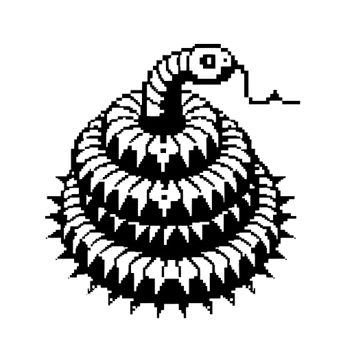

# Retro Snake Game

[](https://forthebadge.com)
[](https://forthebadge.com)
[](https://forthebadge.com)
[](https://forthebadge.com)
[](https://forthebadge.com)



Welcome to the Retro Snake game! This classic game brings back the nostalgia of the old-school arcade era. In this game, you control a snake that grows longer as it eats food. The objective is to navigate the snake around the game board, avoiding the edge of the board and the snake's own body, while collecting as much food as possible.

The game features simple controls, with the snake moving in four directions: up, down, left, and right. As the snake consumes food, it grows longer, making it more challenging to maneuver without colliding with itself or the walls.

Retro Snake offers a thrilling and addictive gameplay experience, testing your reflexes, strategy, and ability to think ahead. Can you guide the snake to become the longest and most skilled player?

Get ready to embark on a journey down memory lane with Retro Snake!

## Live Demo

[](https://refido.github.io/RetroSnake/)

[Live Demo Link](https://refido.github.io/RetroSnake/)

## Controls

- Use the arrow keys to move the snake around the game board.
- Press the space bar to start the game.

## Resources

[Color Hunt](https://colorhunt.co/)

[Google Fonts](https://fonts.google.com/)

### What I Learned

During the development of this project, I learned:

- defer

```html
<script src="script.js" defer></script>    
```

The defer attribute is a boolean attribute that indicates that the script should not be executed until the page has finished parsing. This can be useful if the script needs to work with objects on the page and we want to ensure that these objects are loaded before the script runs. Without defer, the browser will stop parsing the HTML document to fetch and execute the script, which might lead to longer loading times for the webpage.

*Please note that the defer attribute will only work if the src attribute is present. If it's a inline JavaScript code (code within the script tags), the defer attribute will have no effect.*

- The appendChild() method

```javascript
board.appendChild(snakeElement);
```

The appendChild method adds a node to the end of the list of children of a specified parent node. If the given child is a reference to an existing node in the document, appendChild moves it from its current position to the new position.

**So, in this case, snakeElement is being added as the last child node of board.**

- The Math.random() method

```javascript
x: Math.floor(Math.random() * gridSize) + 1
```

Math.random() is a JavaScript function that generates a random floating-point number between 0 (inclusive) and 1 (exclusive). However, this function does not take any arguments to specify a range, so if we want a random number within a specific range, we need to do some additional calculations.

In this case, Math.random() * gridSize is used to generate a random number between 0 and gridSize (exclusive).

The Math.floor() function is then used to round down this floating-point number to the nearest whole number. This is done because grid positions are typically expressed in whole numbers.

So, in summary, this line of code is generating a random grid position between 1 and gridSize (inclusive) and assigning it to the property x.

- JavaScript handles object assignment

```javascript
const head = snake[0]; vs const head = {...snake[0]};
```

const head = snake[0]; directly assigns the first object in the snake array to head. This means head and snake[0] are pointing to the same object in memory. If we modify the properties of head, the changes will also be reflected in snake[0], and vice versa, because they are the same object.

const head = {...snake[0]}; creates a new object and assigns it to head. The new object is a shallow copy of the first object in the snake array. This means head and snake[0] are separate objects in memory. If we modify the properties of head, the changes will not affect snake[0], and vice versa.

*The {...snake[0]} syntax is known as object spread syntax. It creates a new object and copies over the properties of the object being spread (snake[0] in this case) into the new object.*

- How to use the `setInterval()` method to create a game loop.

```javascript
setInterval(() => {
    move();
    checkCollision();
    draw();
}, gameSpeed);
```

setInterval is a built-in JavaScript function that calls a function or evaluates an expression at specified intervals (in milliseconds). It will continue calling the function until clearInterval() is called or the window is closed.

So, in summary, this code is setting up a game loop that updates the game state, checks for collisions, and redraws the game at regular intervals specified by gameSpeed.
